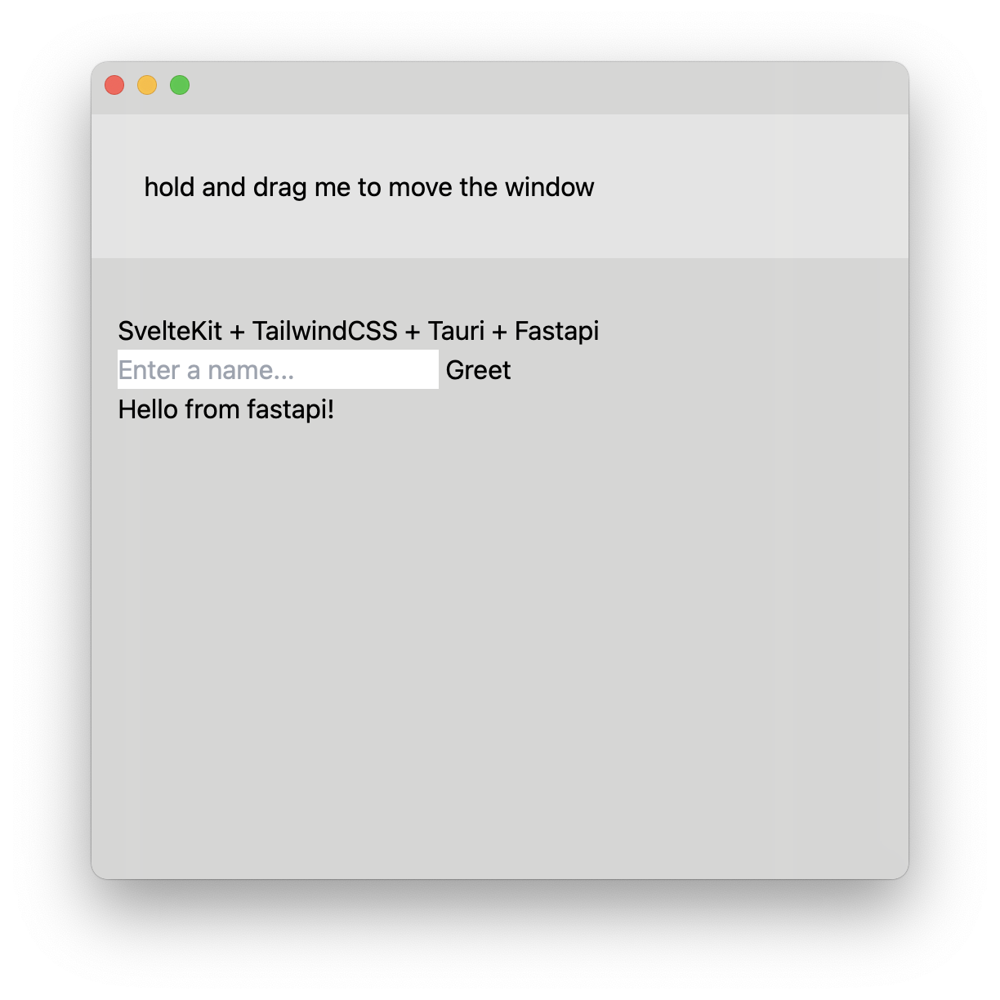

### why

this repo was made as a proof of concept to combine a sveltekit and tailwindcss frontend with a fastapi python backend in a tauri app

### how

- sveltekit + tauri: https://tauri.app/v1/guides/getting-started/setup/sveltekit
- tailwindcss: https://tailwindcss.com/docs/guides/sveltekit
- fastapi: uvicorn
- python: pyinstaller

detailed guide soon?

### where

macOS only currently

### try

executables can be found in releases

### known

when running `cargo tauri dev` there may be an error on first open, the api backend takes a bit long to start, reload window to fix

### screenshot

> window is transparent
